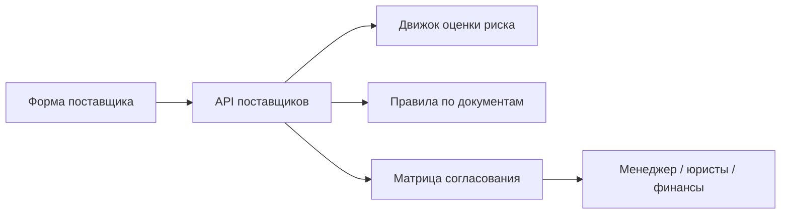

# Архитектура: VendorHub Compliance Portal

## Ключевой принцип

Карточка поставщика сначала проходит оценку риска и полноты документов, а уже потом попадает в соответствующий маршрут согласования.

